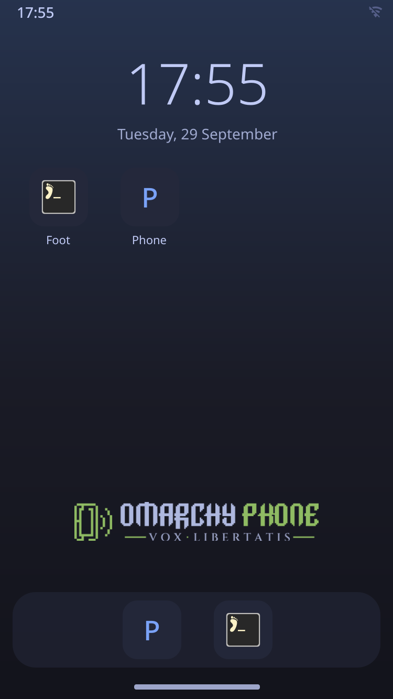

<p align="center">
  <picture>
    <source media="(prefers-color-scheme: dark)" srcset="brand/logo-dark.svg">
    <source media="(prefers-color-scheme: light)" srcset="brand/logo-light.svg">
    
  </picture>
</p>

# Omarchy iPhone6s

Linux on the **iPhone 6s** (Apple A9), running [Omarchy Phone](https://github.com/modpunk/Omarchy-Phone):
Arch Linux ARM and Hyprland with a phone shell, on [HoolockLinux](https://github.com/HoolockLinux),
tethered-booted through checkm8 and pongoOS.

<p align="center">
  
  <br><sub>The Omarchy Phone home screen on the iPhone 6s itself (grim screenshot, 750x1334).</sub>
</p>

## What this is

A HoolockLinux kernel plus drivers, a RAM-only Arch Linux ARM userland, and the tooling to boot
them on an iPhone 6s (N71, Samsung A9) with a tethered chain:

```
checkm8 (palera1n) -> pongoOS -> m1n1 -> Linux + initramfs -> Arch Linux ARM in RAM -> Hyprland
```

Nothing is written to the phone's storage. Reboot it and it is an iPhone again.

## What it is not (yet)

A daily-driver phone. There is no GPU driver (PowerVR GT7600), so Hyprland renders in software
with Mesa llvmpipe. There is no storage or Wi-Fi driver (both sit behind the A9's PCIe block), so
the whole system lives in RAM and is pushed over USB each boot. The touchscreen and battery
charging don't work yet (see below). Input today is a Bluetooth keyboard.

## Status

Tested on one iPhone 6s (N71, Samsung), kernel `7.3.0-rc1-g6831bc701a6c`.

| | |
|---|---|
| **Works, verified on the phone** | simpledrm display (750x1334), all 5 buttons, backlight, PMIC RTC (set from the host each boot), watchdog, both CPU cores, 2 GB RAM, USB networking + serial, extra UART buses, **Bluetooth** (BCM4350, LE scan, BLE keyboard via uhid), **battery gauge** (bq27540 over HDQ through the charger's line switch: %, voltage, current, temperature, health), **SPI controller**, **fast kernel reload** without DFU (kexec with a spin-table CPU park), **Arch Linux ARM userland** (systemd, sshd, BlueZ, PipeWire), **Hyprland 0.56** with software rendering and the **Omarchy Phone shell** |
| **Blocked** | **Touchscreen**: SPI, reset, the analog supply and the input device all work, but the controller stays unpowered because the voltage code for its PMU LDO is unknown. **Charging**: the SN2400 charger is an Apple/TI custom part with no public register map, so Linux can't enable charging; charge in iOS between sessions (idle drain is about 80 mA, roughly 15 hours per charge). |
| **Shelved** | PCIe (NVMe storage, read-only, and Wi-Fi) |
| **Out of scope** | GPU acceleration, audio, camera, modem, sensors behind the AOP coprocessor, NFC, Secure Enclave |

Known rough edges: the Bluetooth keyboard can lose its first key presses when it reconnects
after idling, and pairings don't survive a reload yet.

Per-driver detail lives in [`docs/drivers/`](docs/drivers/), hardware addresses in
[`docs/hardware.md`](docs/hardware.md), the userland in [`docs/userland.md`](docs/userland.md),
and the first successful boot in [`docs/first-boot-2026-09-28.log`](docs/first-boot-2026-09-28.log).

## Quick start

You need a Linux host, an iPhone 6s, a Lightning cable, and the pieces from the
[HoolockLinux setup docs](https://github.com/HoolockLinux/docs): their `linux` kernel tree,
m1n1, the test initramfs, and palera1n + pongoOS + pongoterm. `kit/boot.sh` expects them under
`$HOOLOCK` (override any path with `KSRC`, `BUILD`, `M1N1`, `BIN`, `INITRAMFS`, `OUT`).

```sh
export HOOLOCK=~/hoolock        # linux/, m1n1/m1n1.bin, bin/, initramfs/
kit/boot.sh kernel              # build Image.gz + s8000-n71.dtb / s8003-n71m.dtb (16K pages)
kit/boot.sh blob                # m1n1 + bootargs + dtbs + kernel + initramfs -> out/m1n1-linux.bin
# put the phone in DFU mode
kit/boot.sh pongo               # checkm8 + load pongoOS (sudo)
kit/boot.sh linux               # send the blob and bootm (Ctrl+C once m1n1 starts)
telnet 172.16.42.1              # or: kit/boot.sh shell  (USB serial)
```

After that first boot, new kernels don't need DFU: `kit/reload.sh` kexecs a fresh Image + DTB
(and optionally an initramfs) into the running phone in about 10 seconds
([`docs/fast-reload.md`](docs/fast-reload.md)). The running kernel needs the spin-table park patch
from `patches/fast-reload/`.

To get the full Arch Linux ARM + Hyprland system, reload into the userland ramdisk and stream the
root filesystem over USB with `tools/userland/push-rootfs.sh --go`
([`docs/userland.md`](docs/userland.md)).

The host gets `172.16.42.2` over USB networking. Driver authors: read
[`testkit/TESTING-RULES.md`](testkit/TESTING-RULES.md) before running anything on the phone, and
[`docs/CONTRIBUTING.md`](docs/CONTRIBUTING.md) before opening a PR.

## Layout

```
kit/boot.sh          build + tethered boot
kit/reload.sh        kexec a new kernel + DTB without DFU (kit/fast-reload/: loader, DT merge)
testkit/             phone.sh / phone.py (safe live-test access), kbuild.sh (out-of-tree modules),
                     dtbo_loader (apply DT overlays at runtime), hello (vermagic check), overlays/
tools/               Apple device-tree (ADT) parsers, firmware extraction scripts
tools/userland/      Arch Linux ARM RAM userland (systemd, sshd, Hyprland) + switch_root kit
patches/<driver>/    git format-patch series against HoolockLinux/linux 6831bc701
docs/                hardware inventory, first-boot log, driver notes, userland, contributing guide
brand/               the Omarchy Phone logo (derived from Omarchy's artwork, see below)
```

No Apple or Broadcom binaries are in this repo, and none will be accepted: no IPSW contents,
kernelcache, device-tree dumps, or firmware. Extraction steps live next to the code that needs them.

## License

Kernel code and patches are GPL-2.0 ([`LICENSE`](LICENSE)). Device-tree files follow upstream
Linux and are `GPL-2.0+ OR MIT`, as marked in their SPDX headers.

The Omarchy Phone logo in [`brand/`](brand/) is derived from the Omarchy logo, which is MIT
licensed, © David Heinemeier Hansson; the notice is in
[`brand/LICENSE-omarchy.txt`](brand/LICENSE-omarchy.txt). The source artwork and build scripts
live in the [Omarchy Phone repo](https://github.com/modpunk/Omarchy-Phone/tree/main/brand).

## Credits

- [HoolockLinux](https://github.com/HoolockLinux): the kernel, m1n1 port, ramdisk and docs this builds on
- [Asahi Linux](https://asahilinux.org): m1n1 and the Apple SoC drivers upstream
- Konrad Dybcio and Nick Chan: the A9 / iPhone device trees in mainline Linux
- checkm8 (axi0mX), [palera1n](https://github.com/palera1n/palera1n) and
  [pongoOS](https://github.com/checkra1n/pongoOS): the tethered boot path
- [Arch Linux ARM](https://archlinuxarm.org), [Hyprland](https://hyprland.org) and
  [Omarchy](https://omarchy.org)
- Part identification from the [iFixit iPhone 6s teardown](https://www.ifixit.com/Teardown/iPhone+6s+Teardown/48170)

iPhone is a trademark of Apple Inc. This project is not affiliated with or endorsed by Apple,
HoolockLinux, Omarchy, DHH or 37signals.
